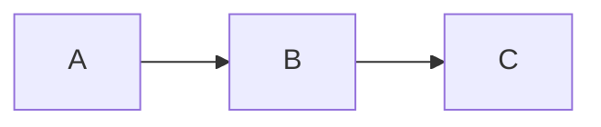

# Markdown Notes Pipeline Implementation Plan

> **For agentic workers:** REQUIRED SUB-SKILL: Use superpowers:subagent-driven-development (recommended) or superpowers:executing-plans to implement this plan task-by-task. Steps use checkbox (`- [ ]`) syntax for tracking.

**Goal:** Convert `notes/*.md` (with YAML frontmatter + mermaid blocks) into styled `notes/<slug>.html` that matches the existing hand-crafted note look, with a GitHub Action that does it automatically on push.

**Architecture:** A Node build script (`scripts/build-notes.mjs`) parses frontmatter via `gray-matter`, renders markdown via `markdown-it` (custom fence handler for mermaid), substitutes into a single template file (`scripts/templates/note.html`), and writes HTML. Mermaid renders client-side via a conditionally-injected `<script>` tag. A GitHub Action runs the build on `notes/**/*.md` changes and commits the generated HTML back; the existing `build-log-index.mjs` then picks up the new note for the homepage feed.

**Tech Stack:** Node 20 (ESM), `markdown-it@14`, `gray-matter@4`, GitHub Actions, GitHub Pages.

**Spec reference:** `docs/superpowers/specs/2026-04-23-markdown-notes-pipeline-design.md`

**Working directory:** repo root = `/Users/srivatsakasagar/Documents/03-Dev-Projects/caseonix`. All paths below are relative to this. All `git` / `node` / `npm` commands run from this directory.

**Push policy:** commits land locally only. Do NOT run `git push` during plan execution — the owner will review the full commit stack and push once at the end. This avoids the CI Actions running mid-plan when components are partially built.

---

## Task 1: Bootstrap root package.json + .gitignore

**Files:**
- Create: `package.json`
- Create: `.gitignore`
- Create: `package-lock.json` (auto-generated by npm)

- [ ] **Step 1: Create `.gitignore`**

Write this exact content to `.gitignore`:

```
node_modules/
.DS_Store
```

- [ ] **Step 2: Create `package.json`**

Write this exact content to `package.json`:

```json
{
  "name": "caseonix-site",
  "version": "0.0.0",
  "private": true,
  "type": "module",
  "description": "Static site + build scripts for caseonix.ca",
  "scripts": {
    "build:notes": "node scripts/build-notes.mjs",
    "build:log": "node scripts/build-log-index.mjs",
    "build": "npm run build:notes && npm run build:log"
  },
  "devDependencies": {
    "gray-matter": "^4.0.3",
    "markdown-it": "^14.1.0"
  }
}
```

- [ ] **Step 3: Install dependencies**

Run:
```bash
npm install
```
Expected: creates `node_modules/` and `package-lock.json`, prints `added N packages`.

- [ ] **Step 4: Verify the deps installed**

Run:
```bash
node -e "import('markdown-it').then(m => console.log('markdown-it OK')); import('gray-matter').then(m => console.log('gray-matter OK'));"
```
Expected output:
```
markdown-it OK
gray-matter OK
```

- [ ] **Step 5: Commit**

```bash
git add .gitignore package.json package-lock.json
git commit -m "Add root package.json + .gitignore for build scripts"
```

Expected: one new commit. `git status` shows `node_modules/` still untracked (ignored, but `git status` can still list it under ignored — the key is it's not staged).

---

## Task 2: Extract note template from auditlm-ai-governance-gap.html

**Files:**
- Create: `scripts/templates/note.html` (copied from an existing note, with placeholders)

The existing `notes/auditlm-ai-governance-gap.html` is 378 lines. We copy it as-is, then replace specific content with `{{placeholder}}` slots. The placeholders the build script expects: `{{title}}`, `{{description}}`, `{{date}}`, `{{slug}}`, `{{keywords}}`, `{{jsonld}}`, `{{body}}`, `{{mermaid_script}}`.

- [ ] **Step 1: Create the templates directory and copy the file**

```bash
mkdir -p scripts/templates
cp notes/auditlm-ai-governance-gap.html scripts/templates/note.html
```

- [ ] **Step 2: Replace the `<title>` tag**

In `scripts/templates/note.html`, find this exact line:
```html
  <title>Research note — AuditLM and the AI governance gap | Caseonix</title>
```
Replace with:
```html
  <title>{{title}} | Caseonix</title>
```

- [ ] **Step 3: Replace the `<meta name="description">` tag**

Find:
```html
  <meta name="description" content="A working research note on AuditLM — a provider-agnostic governance layer for LLMs in regulated industries. Context, landscape, and what I'm building." />
```
Replace with:
```html
  <meta name="description" content="{{description}}" />
```

- [ ] **Step 4: Replace the `<meta name="keywords">` tag**

Find the line starting with `  <meta name="keywords" content="` and replace the entire line with:
```html
  <meta name="keywords" content="{{keywords}}" />
```

- [ ] **Step 5: Replace the canonical + hreflang URLs**

Find all three of these lines:
```html
  <link rel="canonical" href="https://caseonix.ca/notes/auditlm-ai-governance-gap.html" />
  <link rel="alternate" hreflang="en-ca" href="https://caseonix.ca/notes/auditlm-ai-governance-gap.html" />
  <link rel="alternate" hreflang="x-default" href="https://caseonix.ca/notes/auditlm-ai-governance-gap.html" />
```
Replace all three with:
```html
  <link rel="canonical" href="https://caseonix.ca/notes/{{slug}}.html" />
  <link rel="alternate" hreflang="en-ca" href="https://caseonix.ca/notes/{{slug}}.html" />
  <link rel="alternate" hreflang="x-default" href="https://caseonix.ca/notes/{{slug}}.html" />
```

- [ ] **Step 6: Replace the Open Graph tags**

Find this block (it's contiguous in the file):
```html
  <meta property="og:title" content="Research note — AuditLM and the AI governance gap" />
  <meta property="og:description" content="Regulated organizations are deploying LLMs faster than they are governing them. Here is the research lane for AuditLM." />
  <meta property="og:type" content="article" />
  <meta property="og:url" content="https://caseonix.ca/notes/auditlm-ai-governance-gap.html" />
```
Replace with:
```html
  <meta property="og:title" content="{{title}}" />
  <meta property="og:description" content="{{description}}" />
  <meta property="og:type" content="article" />
  <meta property="og:url" content="https://caseonix.ca/notes/{{slug}}.html" />
```

- [ ] **Step 7: Replace article timestamps**

Find:
```html
  <meta property="article:published_time" content="2026-03-18" />
  <meta property="article:modified_time" content="2026-03-18" />
```
Replace with:
```html
  <meta property="article:published_time" content="{{date}}" />
  <meta property="article:modified_time" content="{{date}}" />
```

- [ ] **Step 8: Replace Twitter card tags**

Find:
```html
  <meta name="twitter:title" content="Research note — AuditLM and the AI governance gap" />
  <meta name="twitter:description" content="Regulated orgs are deploying LLMs faster than they are governing them. A working research note on AuditLM." />
```
Replace with:
```html
  <meta name="twitter:title" content="{{title}}" />
  <meta name="twitter:description" content="{{description}}" />
```

- [ ] **Step 9: Replace the JSON-LD block**

Find the entire `<script type="application/ld+json">` block (starts around line 40, ends at the closing `</script>`). Replace the whole block with:

```html
  <script type="application/ld+json">
{{jsonld}}
  </script>
```

- [ ] **Step 10: Replace the article body**

In the `<main class="note-wrapper">` section, find this block:

```html
    <div class="note-eyebrow">&sect; Research note</div>
    <h1 class="note-title">AuditLM and the AI governance gap</h1>
    <div class="note-meta">
      <span>Mar 18, 2026</span>
      <span class="note-meta-sep">&middot;</span>
      <span>Working note &mdash; will evolve</span>
    </div>

    <div class="note-body">
```

(followed by the three `<p>` tags of actual content, followed by `</div>` closing `.note-body`)

Replace the entire block from `<div class="note-eyebrow">` through the closing `</div>` of `.note-body` with:

```html
    <div class="note-eyebrow">&sect; Lab note</div>
    <h1 class="note-title">{{title}}</h1>
    <div class="note-meta">
      <span>{{date_pretty}}</span>
    </div>

    <div class="note-body">
{{body}}
    </div>
```

(Note: `{{date_pretty}}` is NEW — we'll add handling for it in Task 3. The build script will compute a human-readable date like `Mar 18, 2026` from the ISO `{{date}}` and pass both.)

- [ ] **Step 11: Add `{{mermaid_script}}` placeholder**

Find the `</body>` closing tag. Directly before it, add:

```html
  {{mermaid_script}}
</body>
```

So the line now reads with the placeholder on its own line, and `</body>` on its own line. Leave any existing `<script>` tags (theme toggle etc.) exactly where they are — `{{mermaid_script}}` goes after all of them, just before `</body>`.

- [ ] **Step 12: Verify placeholder coverage**

Run:
```bash
grep -oE '\{\{[a-z_]+\}\}' scripts/templates/note.html | sort -u
```

Expected output (exactly these, no more, no less):
```
{{body}}
{{date}}
{{date_pretty}}
{{description}}
{{jsonld}}
{{keywords}}
{{mermaid_script}}
{{slug}}
{{title}}
```

If any are missing or extra, go back and fix.

- [ ] **Step 13: Commit**

```bash
git add scripts/templates/note.html
git commit -m "Extract note template with placeholders from auditlm note"
```

---

## Task 3: Build script — scaffold, scanning, frontmatter validation

**Files:**
- Create: `scripts/build-notes.mjs`

- [ ] **Step 1: Create `scripts/build-notes.mjs` with scaffold + frontmatter validation**

Write this exact content:

```js
#!/usr/bin/env node
// Converts notes/*.md → notes/<slug>.html using scripts/templates/note.html.
// Frontmatter required: title, date, slug, description.
// Frontmatter optional: type (default 'note'), series, tags.

import { readdir, readFile, writeFile } from 'node:fs/promises';
import { join, dirname, basename, extname } from 'node:path';
import { fileURLToPath } from 'node:url';
import matter from 'gray-matter';

const __dirname = dirname(fileURLToPath(import.meta.url));
const ROOT = join(__dirname, '..');
const NOTES_DIR = join(ROOT, 'notes');
const TEMPLATE_PATH = join(__dirname, 'templates', 'note.html');

function assert(cond, msg) {
  if (!cond) throw new Error(msg);
}

function validateFrontmatter(fm, filename) {
  const required = ['title', 'date', 'slug', 'description'];
  for (const key of required) {
    assert(
      fm[key] != null && fm[key] !== '',
      `${filename}: missing required frontmatter field '${key}'`,
    );
  }
  assert(
    /^\d{4}-\d{2}-\d{2}$/.test(fm.date),
    `${filename}: date must be YYYY-MM-DD, got '${fm.date}'`,
  );
  assert(
    /^[a-z0-9-]+$/.test(fm.slug),
    `${filename}: slug must match /^[a-z0-9-]+$/, got '${fm.slug}'`,
  );
  const expectedSlug = basename(filename, '.md');
  assert(
    fm.slug === expectedSlug,
    `${filename}: slug '${fm.slug}' must match filename '${expectedSlug}'`,
  );
  if (fm.type != null && fm.type !== 'note') {
    throw new Error(`${filename}: only type='note' supported in v1, got '${fm.type}'`);
  }
}

async function main() {
  const entries = await readdir(NOTES_DIR);
  const mdFiles = entries.filter((n) => extname(n) === '.md').map((n) => join(NOTES_DIR, n));
  if (mdFiles.length === 0) {
    console.warn('no .md files found in notes/, nothing to build');
    return;
  }
  for (const p of mdFiles) {
    const raw = await readFile(p, 'utf8');
    const { data: fm } = matter(raw);
    validateFrontmatter(fm, basename(p));
    console.log(`  · ${basename(p)} — frontmatter OK`);
  }
  console.log(`validated ${mdFiles.length} note(s)`);
}

main().catch((e) => {
  console.error(e.message);
  process.exit(1);
});
```

- [ ] **Step 2: Run it with no .md files — expect graceful warn**

Run:
```bash
node scripts/build-notes.mjs
```
Expected output:
```
no .md files found in notes/, nothing to build
```
Exit code 0.

- [ ] **Step 3: Create a minimal fixture .md to exercise frontmatter**

Create `notes/_fixture.md` (underscore prefix — the script doesn't filter these out, that's fine; we'll delete this file before completing Task 9):

```markdown
---
title: "Fixture note for build pipeline tests"
date: 2026-04-23
slug: _fixture
description: "Temporary fixture to exercise the build script during development."
---

# Heading

Body paragraph with **bold** and *italic*.
```

- [ ] **Step 4: Run the script — expect success**

Run:
```bash
node scripts/build-notes.mjs
```
Expected output:
```
  · _fixture.md — frontmatter OK
validated 1 note(s)
```

- [ ] **Step 5: Verify validation errors fire correctly**

Temporarily edit `notes/_fixture.md` and remove the `title:` line. Run:
```bash
node scripts/build-notes.mjs
```
Expected: exit code 1, stderr:
```
_fixture.md: missing required frontmatter field 'title'
```

Restore the `title:` line.

Now temporarily change `date: 2026-04-23` to `date: April 23`. Run again. Expected:
```
_fixture.md: date must be YYYY-MM-DD, got 'April 23'
```

Restore to `2026-04-23`.

Now temporarily change `slug: _fixture` to `slug: Fixture` (capital F). Run. Expected:
```
_fixture.md: slug must match /^[a-z0-9-]+$/, got 'Fixture'
```

Restore to `_fixture`. (Note: `_fixture` passes the regex because underscores ARE... wait, they are NOT in `[a-z0-9-]`. This will fail.) If it fails here, that's our test — **change the filename and slug both to `fixture` (no underscore) for the rest of the development**. Update both the filename via `mv` and the frontmatter `slug:` field. Verify the script passes again.

```bash
mv notes/_fixture.md notes/fixture.md
# edit frontmatter: slug: fixture
node scripts/build-notes.mjs
```
Expected: `  · fixture.md — frontmatter OK`.

- [ ] **Step 6: Commit the script (not the fixture)**

```bash
git add scripts/build-notes.mjs
git commit -m "Add build-notes.mjs scaffold + frontmatter validation"
```

The `notes/fixture.md` stays in the working tree, uncommitted. It'll be deleted in Task 9.

---

## Task 4: Build script — markdown rendering + mermaid fence

**Files:**
- Modify: `scripts/build-notes.mjs`

- [ ] **Step 1: Add markdown-it import and body rendering**

Edit `scripts/build-notes.mjs`. At the top, after the existing imports, add:

```js
import MarkdownIt from 'markdown-it';
```

Below the `TEMPLATE_PATH` constant, add:

```js
const md = new MarkdownIt({
  html: true,
  linkify: true,
  typographer: true,
});

// Custom fence for mermaid code blocks — emit as <pre class="mermaid">
// so mermaid.js can transform them client-side.
const defaultFence = md.renderer.rules.fence;
md.renderer.rules.fence = function (tokens, idx, options, env, self) {
  const token = tokens[idx];
  if (token.info.trim() === 'mermaid') {
    return `<pre class="mermaid">${md.utils.escapeHtml(token.content)}</pre>\n`;
  }
  return defaultFence(tokens, idx, options, env, self);
};
```

- [ ] **Step 2: Extend the main loop to render body and detect mermaid**

In `scripts/build-notes.mjs`, replace the body of the `for (const p of mdFiles)` loop with:

```js
  for (const p of mdFiles) {
    const raw = await readFile(p, 'utf8');
    const { data: fm, content } = matter(raw);
    validateFrontmatter(fm, basename(p));
    const body = md.render(content);
    const hasMermaid = body.includes('<pre class="mermaid">');
    console.log(`  · ${basename(p)} — body rendered${hasMermaid ? ' [with mermaid]' : ''}`);
  }
```

Also update the final log line (which currently says `validated ${mdFiles.length} note(s)`) to:

```js
  console.log(`processed ${mdFiles.length} note(s)`);
```

- [ ] **Step 3: Run and verify plain markdown renders**

Run:
```bash
node scripts/build-notes.mjs
```
Expected:
```
  · fixture.md — body rendered
processed 1 note(s)
```

- [ ] **Step 4: Add a mermaid block to fixture and verify detection**

Edit `notes/fixture.md`, append this to the end:

````markdown

## A diagram


````

Run:
```bash
node scripts/build-notes.mjs
```
Expected:
```
  · fixture.md — body rendered [with mermaid]
processed 1 note(s)
```

- [ ] **Step 5: Commit**

```bash
git add scripts/build-notes.mjs
git commit -m "Render markdown body via markdown-it with mermaid fence handler"
```

---

## Task 5: Build script — template substitution, JSON-LD, file output

**Files:**
- Modify: `scripts/build-notes.mjs`

- [ ] **Step 1: Add helper functions before `main()`**

In `scripts/build-notes.mjs`, add these functions above `async function main()`:

```js
const MERMAID_CDN = 'https://cdn.jsdelivr.net/npm/mermaid@11.4.0/dist/mermaid.esm.min.mjs';

const MONTHS = ['Jan','Feb','Mar','Apr','May','Jun','Jul','Aug','Sep','Oct','Nov','Dec'];

function formatDatePretty(iso) {
  const d = new Date(iso + 'T00:00:00Z');
  const day = String(d.getUTCDate()).padStart(2, '0');
  return `${MONTHS[d.getUTCMonth()]} ${day}, ${d.getUTCFullYear()}`;
}

function escapeAttr(s) {
  return String(s)
    .replace(/&/g, '&amp;')
    .replace(/"/g, '&quot;')
    .replace(/</g, '&lt;')
    .replace(/>/g, '&gt;');
}

function buildJsonLd(fm) {
  const obj = {
    '@context': 'https://schema.org',
    '@type': 'Article',
    headline: fm.title,
    description: fm.description,
    author: {
      '@type': 'Person',
      name: 'Srivatsa Kasagar',
      url: 'https://caseonix.ca',
    },
    publisher: {
      '@type': 'Organization',
      name: 'Caseonix',
      url: 'https://caseonix.ca',
      logo: { '@type': 'ImageObject', url: 'https://caseonix.ca/icon-512.png' },
    },
    datePublished: fm.date,
    dateModified: fm.date,
    mainEntityOfPage: {
      '@type': 'WebPage',
      '@id': `https://caseonix.ca/notes/${fm.slug}.html`,
    },
  };
  if (fm.series) {
    obj.isPartOf = { '@type': 'CreativeWorkSeries', name: fm.series };
  }
  return JSON.stringify(obj, null, 2);
}

function mermaidScriptTag() {
  return `<script type="module">
    import mermaid from '${MERMAID_CDN}';
    mermaid.initialize({ startOnLoad: true, theme: 'dark' });
  </script>`;
}

function substitute(template, values) {
  return template.replace(/\{\{([a-z_]+)\}\}/g, (_, key) => {
    if (!(key in values)) throw new Error(`Unknown template placeholder: {{${key}}}`);
    return values[key];
  });
}
```

- [ ] **Step 2: Load the template once and render each note**

Replace the body of `main()` with:

```js
async function main() {
  const entries = await readdir(NOTES_DIR);
  const mdFiles = entries.filter((n) => extname(n) === '.md').map((n) => join(NOTES_DIR, n));
  if (mdFiles.length === 0) {
    console.warn('no .md files found in notes/, nothing to build');
    return;
  }
  const template = await readFile(TEMPLATE_PATH, 'utf8');
  for (const p of mdFiles) {
    const raw = await readFile(p, 'utf8');
    const { data: fm, content } = matter(raw);
    validateFrontmatter(fm, basename(p));
    const body = md.render(content);
    const hasMermaid = body.includes('<pre class="mermaid">');
    const keywords = Array.isArray(fm.tags) ? fm.tags.join(', ') : '';
    const html = substitute(template, {
      title: escapeAttr(fm.title),
      description: escapeAttr(fm.description),
      date: fm.date,
      date_pretty: formatDatePretty(fm.date),
      slug: fm.slug,
      keywords: escapeAttr(keywords),
      jsonld: buildJsonLd(fm),
      body,
      mermaid_script: hasMermaid ? mermaidScriptTag() : '',
    });
    const outPath = join(NOTES_DIR, `${fm.slug}.html`);
    await writeFile(outPath, html);
    console.log(`  · ${basename(p)} → ${fm.slug}.html${hasMermaid ? ' [with mermaid]' : ''}`);
  }
  console.log(`built ${mdFiles.length} note(s)`);
}
```

- [ ] **Step 3: Run the build on the fixture**

Run:
```bash
node scripts/build-notes.mjs
```
Expected:
```
  · fixture.md → fixture.html [with mermaid]
built 1 note(s)
```

- [ ] **Step 4: Inspect the generated `notes/fixture.html`**

Run:
```bash
grep -c '{{' notes/fixture.html
```
Expected output: `0` (no placeholders left unsubstituted — any non-zero means a placeholder leaked through).

Run:
```bash
grep -c '<pre class="mermaid">' notes/fixture.html
```
Expected: `1`.

Run:
```bash
grep -c 'cdn.jsdelivr.net/npm/mermaid' notes/fixture.html
```
Expected: `1`.

Run:
```bash
grep -c 'Fixture note for build pipeline tests' notes/fixture.html
```
Expected: at least `3` (title tag, og:title, twitter:title all get the same title).

- [ ] **Step 5: Verify idempotency**

Run the build twice and confirm the output is byte-identical:
```bash
node scripts/build-notes.mjs
cp notes/fixture.html /tmp/fixture-first.html
node scripts/build-notes.mjs
diff -q notes/fixture.html /tmp/fixture-first.html
```
Expected: no output from `diff` (files identical). If they differ, find the non-deterministic piece and fix before moving on.

- [ ] **Step 6: Commit**

```bash
git add scripts/build-notes.mjs
git commit -m "Render notes via template + JSON-LD + conditional mermaid script"
```

---

## Task 6: Verify mermaid-less path produces no script tag

**Files:**
- Modifies nothing, just verifies Task 5's conditional logic.

- [ ] **Step 1: Make a mermaid-less copy of the fixture**

```bash
cp notes/fixture.md notes/fixture-plain.md
```

Edit `notes/fixture-plain.md` — change `slug: fixture` to `slug: fixture-plain`, change the title to something unique, and delete the entire ```` ```mermaid ```` block (including fences). Save.

- [ ] **Step 2: Build and compare**

Run:
```bash
node scripts/build-notes.mjs
```
Expected: two notes processed, `fixture.html` has `[with mermaid]` marker, `fixture-plain.html` does not.

Run:
```bash
grep -c 'cdn.jsdelivr.net/npm/mermaid' notes/fixture-plain.html
```
Expected: `0` (no mermaid script in a note without mermaid blocks).

Run:
```bash
grep -c 'cdn.jsdelivr.net/npm/mermaid' notes/fixture.html
```
Expected: `1` (still there in the mermaid-bearing note).

- [ ] **Step 3: Clean up the second fixture**

```bash
rm notes/fixture-plain.md notes/fixture-plain.html
```

- [ ] **Step 4: No commit**

Nothing to commit here — this task is purely a verification pass on code already committed in Task 5.

---

## Task 7: GitHub Action — build-notes.yml

**Files:**
- Create: `.github/workflows/build-notes.yml`

- [ ] **Step 1: Create the workflow file**

Write this exact content to `.github/workflows/build-notes.yml`:

```yaml
name: build-notes

on:
  push:
    branches: [main]
    paths:
      - 'notes/**/*.md'
      - 'scripts/build-notes.mjs'
      - 'scripts/templates/note.html'
      - 'package.json'
      - 'package-lock.json'
      - '.github/workflows/build-notes.yml'
  workflow_dispatch:

permissions:
  contents: write

concurrency:
  group: build-notes
  cancel-in-progress: false

jobs:
  build:
    runs-on: ubuntu-latest
    steps:
      - uses: actions/checkout@v4
        with:
          token: ${{ secrets.GITHUB_TOKEN }}

      - uses: actions/setup-node@v4
        with:
          node-version: '20'
          cache: 'npm'

      - name: Install dependencies
        run: npm ci

      - name: Build notes from markdown
        run: node scripts/build-notes.mjs

      - name: Commit if changed
        run: |
          if git diff --quiet -- notes/; then
            echo "No changes under notes/ — skipping commit."
            exit 0
          fi
          git config user.name  "github-actions[bot]"
          git config user.email "41898282+github-actions[bot]@users.noreply.github.com"
          git add notes/
          git commit -m "chore(notes): regenerate HTML from markdown"
          git push
```

- [ ] **Step 2: Verify YAML parses**

Run:
```bash
node -e "const yaml=require('fs').readFileSync('.github/workflows/build-notes.yml','utf8'); console.log(yaml.length, 'bytes'); console.log(yaml.split('\n').length, 'lines');"
```
Expected: prints byte count and line count without throwing. (We don't parse YAML — just verify the file is readable and non-empty. GitHub will validate syntax when the workflow triggers.)

- [ ] **Step 3: Commit**

```bash
git add .github/workflows/build-notes.yml
git commit -m "Add GitHub Action: build notes from markdown on push"
```

---

## Task 8: Clean up fixture before pilot migration

**Files:**
- Delete: `notes/fixture.md`
- Delete: `notes/fixture.html`

- [ ] **Step 1: Remove the fixture files**

```bash
rm notes/fixture.md notes/fixture.html
```

- [ ] **Step 2: Verify clean state**

Run:
```bash
ls notes/*.md 2>/dev/null || echo 'no .md yet'
ls notes/*.html | wc -l
```
Expected: `no .md yet`, and the HTML count matches the five original hand-crafted notes (5).

- [ ] **Step 3: No commit** — the fixture was never committed.

---

## Task 9: Pilot migration — auditlm-ai-governance-gap

**Files:**
- Create: `notes/auditlm-ai-governance-gap.md`
- Backup (uncommitted): `notes/auditlm-ai-governance-gap.html.orig`

**Goal:** produce a `.md` that, when run through the build, generates HTML visually equivalent to the existing `notes/auditlm-ai-governance-gap.html`.

- [ ] **Step 1: Back up the original HTML for comparison**

```bash
cp notes/auditlm-ai-governance-gap.html notes/auditlm-ai-governance-gap.html.orig
```
(`.orig` is ignored by the build script because only `*.md` are processed, and not committed per `.gitignore` — we'll delete it in Step 6.)

- [ ] **Step 2: Create the markdown version**

Write `notes/auditlm-ai-governance-gap.md` with this exact frontmatter:

```markdown
---
title: "Research note — AuditLM and the AI governance gap"
date: 2026-03-18
slug: auditlm-ai-governance-gap
description: "A working research note on AuditLM — a provider-agnostic governance layer for LLMs in regulated industries. Context, landscape, and what I'm building."
series: null
tags: [AI governance, LLM audit trail, OSFI E-23, PIPEDA, AuditLM]
---
```

Then copy the three `<p>` paragraphs from the original `notes/auditlm-ai-governance-gap.html.orig` — look inside `<div class="note-body">` (around lines 325-331) — and convert each to a markdown paragraph. Most HTML entities (`&mdash;`, `&rsquo;`, `&amp;`, `&ldquo;`, `&rdquo;`) can be pasted literally — `markdown-it` passes HTML through because we set `html: true`. But for cleaner source, replace them with actual unicode characters:
- `&mdash;` → `—`
- `&rsquo;` → `’`
- `&ldquo;` → `“`
- `&rdquo;` → `”`
- `&amp;` → `&`

Preserve the `<strong>X</strong>` tags as markdown `**X**` and `<code>X</code>` as markdown `` `X` ``.

- [ ] **Step 3: Run the build**

```bash
node scripts/build-notes.mjs
```
Expected:
```
  · auditlm-ai-governance-gap.md → auditlm-ai-governance-gap.html
built 1 note(s)
```

- [ ] **Step 4: Diff the generated HTML against the original**

```bash
diff notes/auditlm-ai-governance-gap.html.orig notes/auditlm-ai-governance-gap.html | head -100
```

Expected differences (acceptable, don't fix):
- `{{eyebrow}}` — the template emits `§ Lab note`; original said `§ Research note`. Accept the new label; lab notes and research notes unify under one eyebrow going forward. If this is not acceptable, adjust the template in `scripts/templates/note.html` by changing `<div class="note-eyebrow">§ Lab note</div>` back to whatever wording is preferred.
- The note-meta row shows only `Mar 18, 2026`; original had an extra `· Working note — will evolve` slug. This extra slug is not in the frontmatter schema. Accept the loss.
- JSON-LD may differ in key ordering but content should be equivalent. Verify with `grep headline notes/auditlm-ai-governance-gap.html`.
- The `<a class="note-cta">` "Open a thread" CTA block present in the original is NOT in the template (we didn't copy it when extracting — the template ends `.note-body` and goes straight to `</main>`). If you want the CTA back in every note, add it to the template as a static (non-placeholder) block in Step 11 of Task 2 — this is a template edit, not a per-note edit.

**Unacceptable differences** (investigate and fix):
- Missing placeholders (grep for `{{` should return 0 matches — see Task 5 Step 4).
- Empty `<div class="note-body">` — indicates body substitution failed.
- Broken JSON-LD — should parse as valid JSON.

- [ ] **Step 5: Open the generated file in a browser and eyeball it**

```bash
python3 -m http.server 8080 &
SERVER_PID=$!
# Open http://localhost:8080/notes/auditlm-ai-governance-gap.html in a browser
# and visually confirm header, body, nav, footer render correctly.
# Then:
kill $SERVER_PID
```

Subjective check — if the page looks right, proceed.

- [ ] **Step 6: Delete the backup**

```bash
rm notes/auditlm-ai-governance-gap.html.orig
```

- [ ] **Step 7: Commit the pilot**

```bash
git add notes/auditlm-ai-governance-gap.md notes/auditlm-ai-governance-gap.html
git commit -m "Pilot: migrate auditlm-ai-governance-gap to markdown-driven note"
```

---

## Task 10: README update

**Files:**
- Modify: `README.md`

- [ ] **Step 1: Locate the current "Publishing a post" section**

Run:
```bash
grep -n 'Publishing a post' README.md
```
Expected: one line number (the section heading).

- [ ] **Step 2: Replace the section content**

Find this block in `README.md`:

```markdown
## Publishing a post

1. Drop a new HTML file into `/blog/` or `/notes/`. Make sure its JSON-LD includes `headline` and `datePublished`.
2. Commit and push.
3. A GitHub Action (`.github/workflows/build-log-index.yml`) runs `scripts/build-log-index.mjs`, which regenerates `log.json` (full feed) and rewrites the top 4 rows in `index.html` between the `<!-- log:auto-start -->` markers. It commits the refresh back to `main` automatically.

To run the build locally instead: `node scripts/build-log-index.mjs`.
```

Replace with:

```markdown
## Publishing a post

### Lab notes (`/notes/`)

Write in markdown. Drop a new `.md` file into `/notes/` with YAML frontmatter:

```yaml
---
title: "Lab note — how I broke RAG"
date: 2026-04-23
slug: how-i-broke-rag
description: "A one-paragraph summary used in meta description and og:description."
tags: [rag, cloudflare]     # optional
series: null                 # optional, for multi-part series
---
```

Required fields: `title`, `date` (YYYY-MM-DD), `slug` (must match filename), `description`. Optional: `type` (defaults to `note`), `series`, `tags`.

The body is plain markdown. Mermaid diagrams work:

````

````

Commit and push. A GitHub Action (`.github/workflows/build-notes.yml`) runs `scripts/build-notes.mjs`, generates the HTML, and commits it back to `main`. A second Action (`build-log-index.yml`) then updates `log.json` and the homepage § RECENT FROM THE LOG rows. End-to-end latency: ~60-90s from `git push` to live.

To run the build locally: `npm run build:notes` (or `npm run build` to also refresh the log index).

### Blog posts (`/blog/`)

Blog posts are still hand-authored HTML with JSON-LD. Drop the file, commit, push — `build-log-index.yml` picks it up for the homepage feed.
```

- [ ] **Step 3: Commit**

```bash
git add README.md
git commit -m "README: document markdown note publishing workflow"
```

---

## Task 11: Final end-to-end verification

**Files:** none — pure verification.

- [ ] **Step 1: Run the full build from a clean state**

```bash
npm run build
```

Expected: builds all `.md` notes (one, the pilot), updates `log.json` and `index.html`. No errors. No placeholders remain.

- [ ] **Step 2: Verify the pilot note appears in log.json**

Run:
```bash
grep -A2 auditlm-ai-governance-gap log.json | head -12
```
Expected: an entry with title, date, type:"note", href pointing to `/notes/auditlm-ai-governance-gap.html`.

- [ ] **Step 3: Review git log for the plan's commits**

Run:
```bash
git log --oneline -15
```

Expected recent commits (exact order, adjust for any merge/rebase):
```
<hash> README: document markdown note publishing workflow
<hash> Pilot: migrate auditlm-ai-governance-gap to markdown-driven note
<hash> Add GitHub Action: build notes from markdown on push
<hash> Render notes via template + JSON-LD + conditional mermaid script
<hash> Render markdown body via markdown-it with mermaid fence handler
<hash> Add build-notes.mjs scaffold + frontmatter validation
<hash> Extract note template with placeholders from auditlm note
<hash> Add root package.json + .gitignore for build scripts
```

Eight commits. If any are missing, go back and complete that task.

- [ ] **Step 4: No automated test suite**

Per the spec, this round ships without an automated test suite. The verifications above are the acceptance criteria. If any of them fail, do not push — iterate first.

- [ ] **Step 5: Final commit (if anything was regenerated)**

If `npm run build` in Step 1 modified `notes/*.html` or `log.json` or `index.html`, those changes are from running the existing `build-log-index.mjs` against the new pilot note — commit them:

```bash
git add -A
git status        # review what's staged
git commit -m "Regenerate log index for pilot markdown note" || echo "nothing to commit"
```

---

## Follow-ups explicitly out of scope

(Listed in the spec's Risks/follow-ups section; do NOT implement any of these as part of this plan.)

- Syntax highlighting for non-mermaid code blocks (Prism / Shiki / highlight.js).
- Draft support via `draft: true` frontmatter field.
- Migration of the other four hand-crafted notes.
- Extending the pipeline to `/blog/`.
- Tag pages, archive index, RSS feed.
- SRI hash for the mermaid CDN script.
- Collapsing the two workflows (`build-notes.yml` + `build-log-index.yml`) into one to reduce bot commits.
